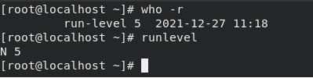
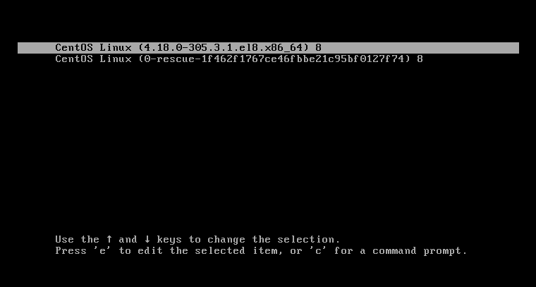
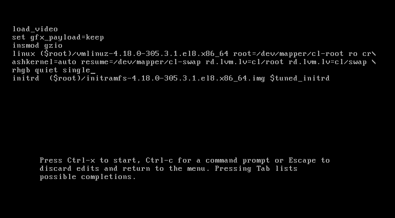
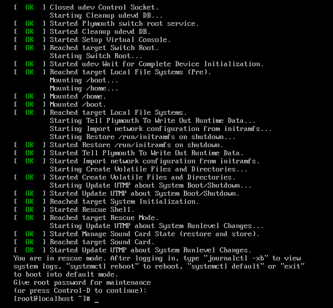
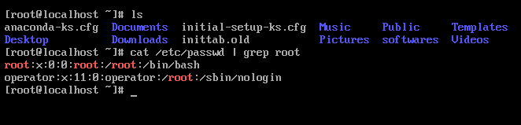
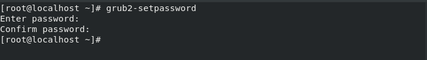

# Administration Unix : TP4 : Niveaux de fonctionnement

## Exercice 1

1. Niveau de fonctionnement actuel de la machine

```console
[root@localhost ~]# runlevel
## ou bien
[root@localhost ~]# who -r
```

<p align=center>
    
</p>

2. démons/services lancés au démarrage au niveau 3

```console
[root@localhost ~]# ls /etc/rc3.d
```

3. Les répértoires /etc/rc.d/rcX.d contiennent des scripts qui peuvent être executer au niveau de fonctionnement X avec $X \in \{0,1,2,3,4,5,6\}$
4. Tout fichier appartenant au répertoire /etc/rc.d/rcX.d ont des noms qui commence par K ou bien S :

   - **S** : Pour les noms des scripts qui lancent des services (Start)
   - **K** : Pour les noms des scripts qui arrêtent des services (Stop)

5. chaque script porte un numero entre 0 et 99, ce dernier indique l'ordre d'exécution des scripts. On commence par le numéro le plus petit jusqu'au plus grand.
6. Passer le système du niveau actuel au niveau 2 :

```console
[root@localhost ~]# init 2
```

## Exercice 2

1. Lister l’ensemble des programmes avec leurs états

```console
[root@localhost ~]# chkconfig
```

2. L'etat du service sendmail

```console
[root@localhost ~]# chkconfig list sendmail
```

3. Trouver le chemin vers le script associé à «sendmail» dans les répertoires correspondants aux niveaux 3 et 5

```console
[root@localhost ~]# ls /etc/rc.d/rc3.d | grep sendmail
[root@localhost ~]# ls /etc/rc.d/rc5.d | grep sendmail
```

4. Paramétrer le niveau 3 pour que « sendmail » ne se lance pas dans ce niveau

```console
[root@localhost ~]# chkconfig level 3 sendmail off
```

5. Revérifier les noms du script associé à « sendmail » dans les répertoires correspondants au niveau 3 et 5

```console
[root@localhost ~]# chkconfig level 3 sendmail on
```

6. Permettre à «sendmail»pour qu’il ne démarre qu'au niveau 3
7. Utiliser l’outil «ntsysv»pour désactiver le service «isdn» dans les niveaux de fonctionnement 5 et 3

```console
[root@localhost ~]# ntsysv level 3 5
```

<p align=center>
    
</p>

10. Copie de inittab

```console
[root@localhost ~]# cp /etc/inittab inittab.old
```

11. le fichier inittab est le fichier de configuration du processus « init », il contient des lignes qui ont la structure suivante:

_Label :Niveaux :action :commande arg1 arg2_

12. La ligne qui précise le niveau de démarrage par défaut du système est : **id:5:initdefault:...**

## Exercice 3

1. Accéder au mode single :

- Etape 1

<p align=center>
    
</p>

- Etape 2

<p align=center>
    
</p>

- Etape 3

<p align=center>
    
</p>

3. Tester quelques commandes

<p align=center>
    
</p>

4. Passage au niveau 5

```console
[root@localhost ~]# init 5
```

5. Proteger GRUB

```console
[root@localhost ~]# cp /etc/grub.conf grub.cp.conf
[root@localhost ~]# grub2-setpassword
```

<p align=center>
    
</p>

- Apres le redemarage le mot de paase doit etre renseigner pour editer le GRUB

<p align=center>
    
</p>
