# Administration Unix : TP 5 : Gestion du système de fichiers

## Exercice 1 : Gestoin de l'environnement

1. Informations correspondantes à mon compte sur le système:

```console
[root@localhost ~]# uname -a
```

<p align=center>
    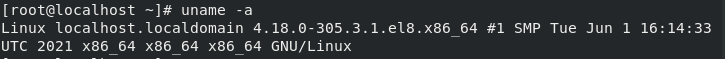
</p>

1. Modifier mot de passe

```console
[root@localhost ~]# passwd
```

<p align=center>
    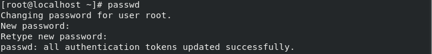
</p>

3. Afficher les variables de votre environnement de travail

```console
[root@localhost ~]# printenv
```

<p align=center>
    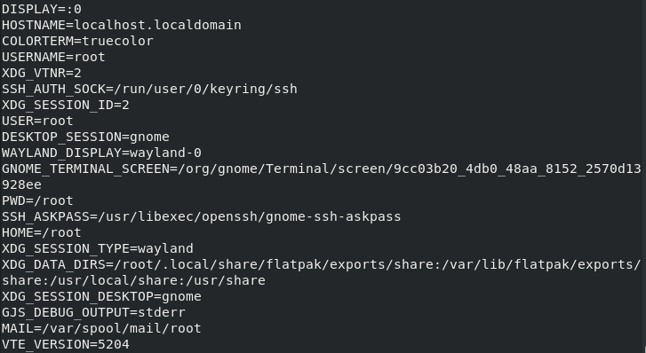
</p>

4. Afficher la liste des utilisateurs connectés au système

```console
[root@localhost ~]# w
[root@localhost ~]# who # ou bien
[root@localhost ~]# users # ou bien
```

<p align=center>
    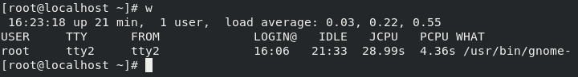
</p>

6. Afficher la date du système

```console
[root@localhost ~]# date
```

<p align=center>
    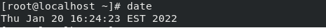
</p>

7. Afficher le type du système sur lequel vous travaillez, et sa version ?

```console
[root@localhost ~]# uname -o
```

<p align=center>
    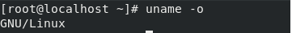
</p>

8. Effacer votre écran

```console
[root@localhost ~]# clear
```

9.  Afficher le nom de votre terminal, puis ses caractéristiques

```console
[root@localhost ~]# uname -o
```

10. Afficher une phrase de votre choix sur l’écran

```console
[root@localhost ~]# echo "Hello World!"
```

## Exercice 2 : Gestion des fichiers

1. Copier le fichier /etc/group dans votre répertoire de travail sous le même nom
2. Renommer le fichier que vous venez de copier en lui affectant le nom g1.

```console
[root@localhost ~]# cp /etc/group g1
```

2. Créer un lien symbolique sur g1, appeler le g1liensym

```console
[root@localhost ~]# ln -s g1 g1liensym
```

<p align=center>
    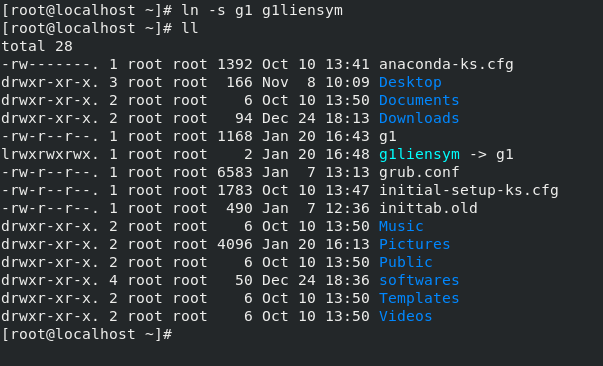
</p>

1. Créer un lien dur sur g1, appeler le g1liendur.

```console
[root@localhost ~]# ln g1 g1liendur
```

<p align=center>
    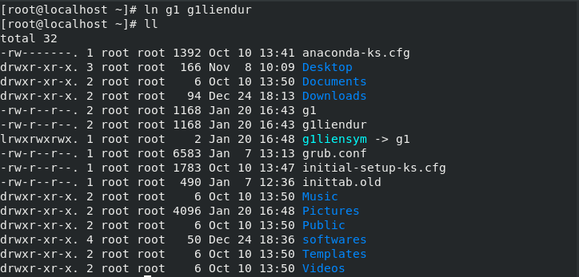
</p>

1. Afficher les contenus des fichiers g1, g1liensym et g1liendur ? Que remarquez-vous

- les 3 fichiers possèdent le meme contenu

6. Copier g1 dans un autre fichier de nom g2
7. Supprimer le fichier g2

```console
[root@localhost ~]# cp g1 g2
[root@localhost ~]# rm g2
```

8. Afficher le nombre de lignes, de mots et de caractères du fichier g1

```console
[root@localhost ~]# wc -l g1
[root@localhost ~]# wc -w g1
[root@localhost ~]# wc -c g1
```

<p align=center>
    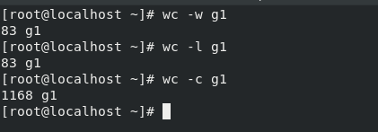
</p>

1. Afficher le contenu de g1

```console
[root@localhost ~]# cat g1
```

10. Afficher le fichier g1 trié

```console
[root@localhost ~]# sort g1
```

12. Afficher les 5 premières lignes de g1 puis les 5 dernières

```console
[root@localhost ~]# head -5 g1
[root@localhost ~]# tail -5 g1
```

<p align=center>
    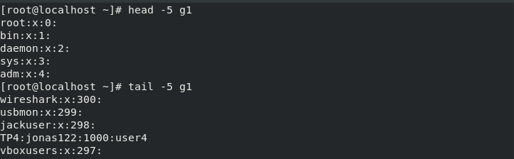
</p>

1.  Afficher page par page le fichier /etc/passwd du système.

```console
[root@localhost ~]# more /etc/passwd
```

<p align=center>
    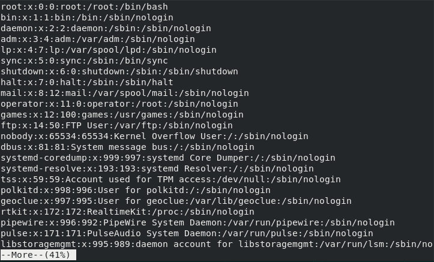
</p>

1.  Afficher toutes les lignes contenant la chaîne « user » dans le fichier /etc/passwd

```console
[root@localhost ~]# grep user /etc/passwd
```

15. Afficher la ligne qui vous concerne dans /etc/passwd

```console
[root@localhost ~]# grep ^$(whoami) /etc/passwd
```

<p align=center>
    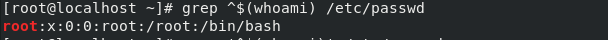
</p>

## Exercice 3 : Gestion des répertoires
