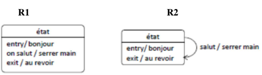

# Exam : Modelisation orienté objet 2022

## Exercice 1

Modéliser les phrases suivantes par un diagramme de classes, notamment déterminez la relation statique appropriée (_généralisation_, _composition_, _agrégation_ ou _association_)

1. Un message électronique comporte un titre ainsi que l'adresse du destinataire. Il est constitué d'un entête et d'un corps du message. Il peut contenir éventuellement une ou plusieurs pièces jointes.

Réponse

 

2. Une maison est louée par 0 ou plusieurs locataires à des dates différentes.

Réponse

 

3. L'accès à certaines unités de valeurs (UV) est conditionné par des pré-requis. Les UV elles-mêmes pré-requises constituent un pré-requis pour la préparation d'une ou plusieurs autres UV

Réponse

 

## Exercice 2

Donner le diagramme de cas d'utilisation correspondant à la description suivante.

Dans un établissement scolaire, on désire gérer la réservation des salles de cours ainsi que du matériel pédagogique (ordinateur portable ou/et Vidéo projecteur). Seuls les enseignants sont habilités à effectuer des réservations (sous réserve de disponibilité de la salle ou du matériel). Le planning des salles peut quant à lui être consulté par tout le monde (enseignants et étudiants). Par contre, le récapitulatif horaire par enseignant ne peut être consulté que par les enseignants. Enfin, il existe pour chaque formation un enseignant responsable qui seul peut éditer le récapitulatif horaire pour l'ensemble de la formation.

Réponse

 

## Exercice 3

Donner le diagramme d'état-transistion (utiliser juste les événements, gardes et actions)

On s'interesse au traitement d'une commande. Le début c'est l'état en cours. Une fois en cours, elle peut-être abondonnée par le client ou par la société si le client ne se présente pas dans un délai. La commande n'est accépté que si le client paie une avance. Une commande accéptée peut aussi être suspendue pour une période de temps ou à la demande du client. Si le client paie le reste du montant de la commande, alors la commande peut être livrée, sinon la commande est annulée. Une commande suspendue peut redevenir acceptée à la fin du delai ou à la demande du client ou être annulée.

**Note importante** (A ne pas utiliser le diagramme composite, les points de jonction et points de choix)

Réponse

 

## Exercice 4

1. Citer trois points de differences entre l'agrégation et la composition

Réponse

 

2. Citer trois points de differences entre une action et une activité

Réponse

 

3. Quel est l'objectif du diagramme de séquence objet et à quelle phase de cycle de vie du logiciel il est utile.

Réponse

 

4. A quel type de diagramme appartient cette figure?

    

5. Ces deux représentations sont-elles équivalentes? Si oui/non justifiez.

Réponse

 
