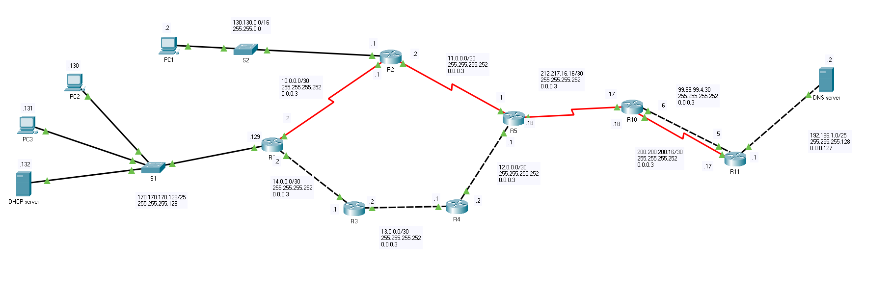

# Atelier N°3 : Technologie de routage : Synthèse

## Objectifs : Configuration du routage dynamique RIP & OSPF.

### Exercice 1 :

Vous êtes responsable de l'administration du réseau ci-après. Vous devez configurer les routeurs de votre entreprise pour assurer les communications entre tous les segments de votre inter-réseau.

    

L'adressage vous sera communiqué lors de la seance des TPs.

1. Configurez les interfaces des machines et routeurs.
2. Configurez le routage RIPv2 entre R1, R2, R3, R4 et R5.
3. Configurez le routage OSPF entre R10 et R11 ?
4. Pour relier les deux nuages RIPv2 et OSPF, ajouter une route par défaut sur le routeur R5 et R10. Propagez la route par defaut de R5 sur le nuage RIPv2 et la route par defaut d R10 sur le nuage OSPF
5. Testez les pings entre l'ensemble des machines.
6. Tracez la route entre les machines et le serveur DNS (`tracert IP-DNS`). Quels sont les routeurs et les liens traversés? Justifiez pourquoi ces liens ont été choisis ?
7. Si on avait RIPv2 a la place d’OSPF sur les routeurs R10 et R11 quelles sont les conséquences de ce changement sur les routes ?
8. Configurez le service DHCP, puis configurer les machines PC0 et PC2 comme clients DHCP.

### Exercice 2

- Résumer les réseaux suivants:

  - `10.1.0.0/16` ; `100.1.1.0/24` ; `212.1.20.0/26`
  - `1.1.1.0/24` ; `1.1.2.0/26` ; `1.1.20.0/27`

- Vous disposez du réseaux `10.1.0.0/16`
  - Segmentez-le pour supporter 2 sous-réseaux de 800 et 100 machines
