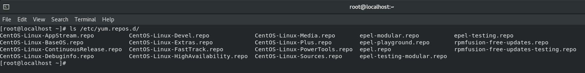
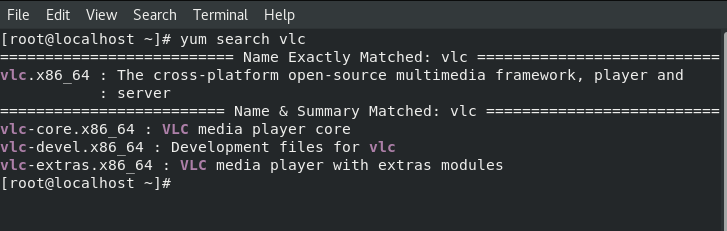
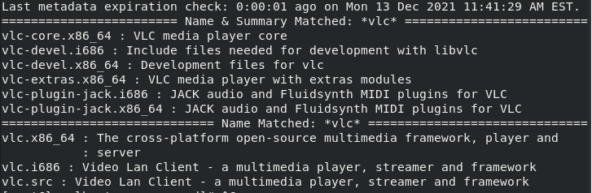
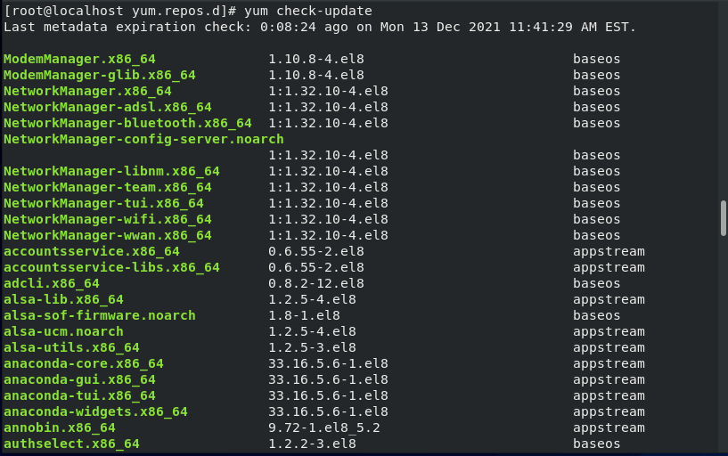
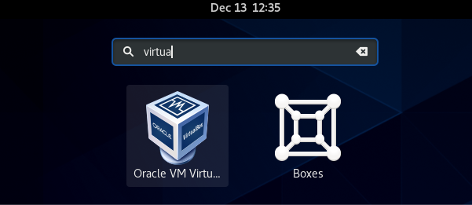
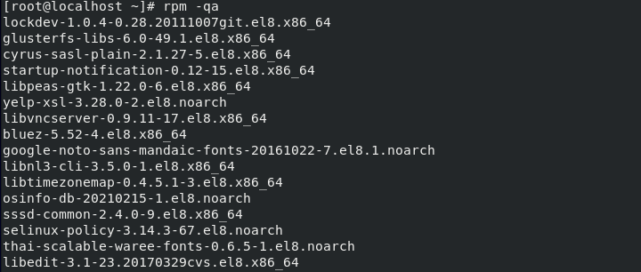
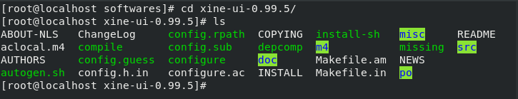

# TP 3: Installation des logiciels

## Exercice 1: Installation par yum

---

1. Verfication de la connexion Internet

```s
[root@localhost ~]# ping www.facebook.com
```

2. Liste des depots

```s
[root@localhost ~]# ls -l /etc/yum.repos.d
```

<p align=center>
   
</p>

3. Vérification si VLC est installé

```s
[root@localhost ~]# yum search vlc
```

<p align=center>
   
</p>

1. Installation de VLC :

```s
[root@localhost ~]# yum install vlc
```

5. Ajout du depot qui contient VLC

```s
[root@localhost ~]# cd /etc/yum.repos.d
[root@localhost ~]# wget http://pkgrepo.linuxtech.net/el6/release/linuxtech.repo
[root@localhost ~]# yum search *vlc*
```

<p align=center>
   
</p>

```s
[root@localhost ~]# yum install vlc-core.x86_64
```

6. Verification des mises a jour

```s
[root@localhost ~]# yum check-update
```

<p align=center>
   
</p>

1. Desinstaller un package

```s
[root@localhost ~]# yum remove vlc
```

8. Installer virtual box en utilisant yum
   1. Installation des outils necessairs
      - `yum install –y patch gcc kernel-headers kernel-devel`
   1. Installation de VirtualBox Oracle repository
      - `wget https://download.virtualbox.org/virtualbox/rpm/el/virtualbox.repo`
   1. Install VirtualBox 6.1 a partir du repo installer
      - `yum install VirtualBox-6.1`

<p align=center>
   
</p>

## Exercice 2: Gestion des paquetages par la commande rpm

1. Un paquetage est une archive (fichier compressé) comprenant les fichiers informatiques, les informations et procédures nécessaires à l'installation d'un logiciel sur un système d'exploitation.
2. Description des paquetages:

Un nom de package est composé de:

_NomDuPaquetage-Version-NumBuild_ **.** _Architecture_ **.** rpm

- **mysql-5.1.73-3.el6_5.x86_64.rpm**: compatible avec une architecture 64bits du systeme
- **mysql-5.1.73-3.el6_5.x86.rpm**: compatile avec une architecture 32bits du systeme
- **mysql-5.1.73-3.el6_5.sparc.rpm**: compatile avec une architecture sparc du systeme
- **mysql-5.1.73-3.el6_5.amd.rpm**: compatile avec une architecture amd du systeme

3. Pour ma machine je peut installé le premier package puisque mon CPU est de 64 bits.
   - Commande pour afficher l'architecture du PC est : `uname -m`
4. lister tout les paquetages deja installées:

```s
[root@localhost ~]# rpm --help
[root@localhost ~]# rpm -qa
```

<p align=center>
   
</p>

5. Recherche du paquetage mysql

```s
[root@localhost ~]# rpm -qa | grep mysql
```

6. X
7. X
8. X
9. X
10. rpm -U, mettre à jour un paquage
11. rpm -F, : mettre à jour les packages deja exstants
12. rpm -qf /etc/passwd; affiche le nom du logiciel responsable du fichier /etc/passwd
13. rpm -ql setup, liste les fichiers contenue dans le packetaque setup

## Exercice 3: Installation de logiciel depuis la source

1. Dans le dossier /root/softwares il ya deux fichiers _xine-lib-1.1.0.tar_ et _xine-ui-0.99.4.tar.gz_
2. Il existe deux type d'extension:
   - `.tar` : qui signifie que le fichier est archivé, c-à-d c'est une collection de plusieur fichiers réunis dans un seul fichier.
   - `.tar.gz` : qui signifie un fichier comprésser
3. Decompresser et de-sarchiver le fichier

   - Decompression du fichier `xine-lib-1.1.0.tar.gz`

   ```s
   [root@localhost ~]# gunzip xine-lib-1.1.0.tar.gz
   ```

   - Des-archiver le fichier `xine-lib-1.1.0.tar`

   ```s
   [root@localhost ~]# tar xine-lib-1.1.0.tar
   ```

   - Contenu du dossier xine

   <p align=center>
      
   </p>

   - lancer le script ./config

   ```s
   [root@localhost ~]# ./configure // ne marche pas!
   [root@localhost ~]# yum install gcc-c++ // Le fichier necessite le gcc-c++ compiler pour s'executer
   [root@localhost ~]# ./configure // apres installation de gcc-c++ la commande marche
   [root@localhost ~]# make
   [root@localhost ~]# make install
   ```

4. Installation de xine-ui

```s
   [root@localhost ~]# gunzip xine-ui-0.99.4.tar.gz
   [root@localhost ~]# tar xine-lib-1.1.0.tar
   [root@localhost ~]# ./configure
   [root@localhost ~]# rpm -ivh xine-lib-devel-1.2.11-3.el8.x86_64.rpm  #installer les dependances
   [root@localhost ~]# ./configure
```

5. Installation de nagios

```s
   [root@localhost ~]# gunzip nagios-4.3.4.tar.gz
   [root@localhost ~]# tar -xvf nagios-4.3.4.tar
   [root@localhost ~]# ./configure
   [root@localhost ~]# make
   [root@localhost ~]# make install
```

6. Pour supprimer un programme installer depuis le code source il suffit d'éxecuter la commande suivante

```s
   [root@localhost ~]# make clean
```

Cette commande effectue un nettoyage de tous les objets ainsi que les exécutables.

## Exercice 4: Autre type d’installation
