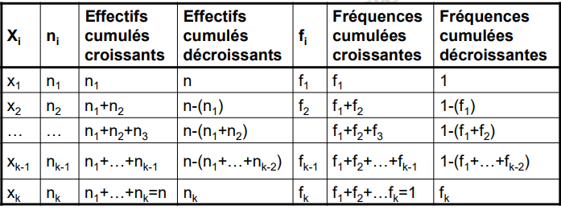
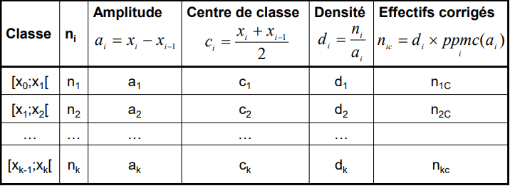

# Outils Mathématiques

## Ressources

- [Statistics](https://www.youtube.com/playlist?list=PL0o_zxa4K1BVsziIRdfv4Hl4UIqDZhXWV)
- [Cours Prof]()

## Table of content

- **Partie 1**: Statistique et Probabilité
  - [Statistique Descriptive]()
    - [Vocabulaire]()
    - [Representation graphique]()
    - [Les caractéristiques de position]()
    - [Les caractéristiques de dispersion]()
    - [Les caractéristiques de forme]()
  - [Probabilité]()
  - [Statistique inferentielle]()

## Statistique Descriptive

La statistique descriptive est un ensemble de methodes
(representations graphiques et calculs de caracteristiques
numeriques) permettant de faire une synthese statistique de
donnees. Les donnees a examiner proviennent generalement d’un
echantillon

### Vocabulaire

- **Population:** La population est un ensemble d’individus: personnes, objets ou éléments sur lesquels on veut effectuer l’étude statistique.
  Ces individus sont définis par une propriété commune donnée. La taille d’une population est le nombre d’individus qui la composent.

- **Individu (ou unité statistique):** Un élément de la population.
- **Echantillon:** Sous-ensemble de la population.
- **Caractère ou variable:** C'est la propriété commune de la population étudiée, qui est observée ou mesurée sur les individus de cette population statistique.
- **Modalité:** On appelle une modalité la valeur que peut prendre un
  caractère.

- **Types de caractères:**

- **Les variables quantitatve:** ce sont les variables qui prennent des valeurs numériques. Ces variables décrivent une certaine quantité sur l'individu et sont souvent mesurées (par exemple, la masse corporelle est mesurée avec une échelle) ou comptées (par exemple, le nombre de piqûres d'aiguilles nécessaires pour obtenir l'échantillon de biopsie est compté).

  - _Quantitatives discretes:_ sont des variables pour lesquelles les valeurs qu'elle peut prendre sont dénombrables et ont un nombre fini de possibilités. Les valeurs sont souvent des entiers. Exemples:
    - Nombre d'enfants par famille
    - Nombre d'élèves dans une classe
    - Nombre de citoyens d'un pays
  - _Quantitative continue:_ sont des variables dont les valeurs ne sont pas dénombrables et ont un nombre infini de possibilités. Exemples:
    - Âge
    - Poids
    - Hauteur

- **Les variables qualitatives:** sont des variables qui ne sont pas numériques et dont les valeurs rentrent dans des catégories.
  Autrement dit, une variable qualitative est une variable qui prend pour valeurs des modalités, des catégories, voire des niveaux, par opposition aux variables quantitatives qui mesurent une quantité sur chaque individu.
  Les variables qualitatives sont divisées en deux types : nominales et ordinales.

  - _Qualitative nominale:_ est une variable qualitative où aucun ordre n'est possible ou implicite dans les niveaux. Par exemple, la variable genre est nominale car il n'y a pas d'ordre dans les niveaux féminin/masculin.
  - _Qualitative ordonée:_ est une variable qualitative avec un ordre impliqué dans les niveaux. Par exemple, le niveau de satisfaction en 5 classes allant de « très insatisfait » à « très satisfait », la protéinurie mesurée à la bandelette urinaire de 0 à +++ sont des variables qualitatives ordinales.

- On appelle **centre** de la classe [$e_{i}$ , $e_{i+1}$[ le nombre noté $c_{i}$ defini par $c_{i}=\frac{e_{i}+e_{i+1}}{2}$

- On appelle amplitude de la classe [$e_{i}$ , $e_{i+1}$[ , le nombre noté $a_{i}$ et défini par $a_{i}= e_{i+1} - e_{i}$

### Effectifs ou proportion

- **qualitatif ou quantitatif discrète:** le nombre d'individus presentant une modalité $x_{i}$ donnée, est appelé **Effectif** de la modalité on la note $n_{i}$
- **qauntitative continue:** le nombra d'individus presentant une valeur appartenant a la classe [$e_{i}$ , $e_{i+1}$[ donnée de centre $c_{i}$, est appelée EFFECTIF de la classe $i$ on le note $n_{i}$

### Effectifs Cumulé

- l' effectif cumulé de la valeur x est la somme des effectifs de toutes les valeurs inférieures ou égales à x

### Frequence et fréquence cumulé

- On appelle fréquence de la valeur $x_{i}$ ou de la classe ]$x_{i}$ , $x_{i+1}$] le nombre réel $f_{i}=\frac{n_{i}}{N}$
- C’est la proportion de l’effectif d’une valeur de la variable par rapport à N la taille totale de la population ou de l’échantillon
- On appelle fréquence cumulée de la valeur $x_{i}$ ou de la classe ]$x_{i}$ , $x_{i+1}$] la somme des fréquences de cette valeur ou classe et des fréquences des aleurs ou classes qui la précèdent $F_{i}=\sum_{k = 1}^{i} f_{i}$
- C’est la proportion des unités statistiques de la population ou de l’échantillon qui possèdent une valeur inférieure ou égale à une valeur $x$ donnée d’une variable quantitative.

### Tableau récapitulatif

- Pour une variable **qualitative** ou une variable **quantitative discrète** (non classée)

- Pour une variable quantitative continue: Pour les effectifs cumulés et les fréquences cumulées c’est la même chose que les variables qualitatives.

[comment]: <> (TODO: http://www.fsr.ac.ma/DOC/Cours_en_ligne/Automne_2020/LICENCES/LF/SMI/S3/Module%2018%20Statistique%20et%20Probabilite/Cours/Documents/cours%20-%20Staistique%20SMI3.pdf )

[comment]: <> (TODO: file:///D:/ENSIAS/S1/Outils%20Math%C3%A9matiques/Cours/pr%20AOURAGH%20_Statistique%20descriptivegr%20A%20B.pdf )

## Représentations graphiques

### Représentations graphiques d’une distribution de variables qualitatives

- Les tuyaux d’orgues

- Représentation circulaire

### Représentations graphiques d’une distribution de variables quantitatives discrètes

- Diagramme en bâtons
- Polygone des fréquences
- Courbe des fréquences cumulées

### Représentations graphiques d’une distribution de variables quantitatives continues

D'abord pour dresser le tableau de distribution, on pourra suivre les étapes suivantes :

**Etape 1**: Déterminer p le nombre de classes à considérer dans l’étude

i) Règle de Sturge : $P = 1 + 3.3 \times \log(N)$

ii) Règle de Yule : $P = 2.5 \times \sqrt[4]{N}$

Avec $p$ = l’entier naturel le plus proche de $P$.

**Etape 2** : Calculer l’étendue $e = x_{max} - x_{min}$ où $x_{min}$ est la valeur minimale de la variable $X$ et $x_{max}$ est la valeur maximale de la variable $X$

**Etape 3** : Diviser l’étendue e par p le nombre de classes, pour avoir une idée sur la valeur de l’amplitude des classes que l’on notera a. on a, $a = \frac{e}{p}$

**Etape 4** : On construit alors les classes

**Etape 5** : S’assurer que chaque observation appartient à une et une seule classe

Les différentes representations graphiques:

- Histogramme
- Polygone des fréquences
- Courbe des fréquences cumulées

## Les paramètres statistiques

- Paramètres de position
- Paramètres de dispersion
- Paramètres de forme

### Paramètres de position

#### Le mode

- C'est une valeur de la variable pour laquelle l’effectif ou la fréquence est maximal(e). Le mode est noté $m_{d}$

- Dans le cas d’une variable quantitative continue, les données sont regroupées en classes. Si les classes sont toutes de même amplitude, une classe modale est celle dont la fréquence ou l’effectif est le plus élevé.

- Si les classes ne sont pas de même amplitude, on doit obligatoirement corriger les effectifs et les fréquences (c’est à dire rendre les classes de même amplitude) avant de construire:
  - Construire l’histogramme
  - Construire le polygône des fréquences
  - Déterminer la classes modale

#### La médiane

- La médiane est la valeur me de la variable qui partage les éléments de la série statistique, préalablement classés par ordre croissant, en deux groupes d’effectifs égaux : 50% des individus présentent une valeur inférieure ou égale à la médiane et 50% présentent une valeur supérieure ou égale à la médiane.

- Pour une variable quantitative discrète

$
m_{d} = \begin{cases}  x(\frac{N+1}{2})  \\ x(\frac{N}{2}) \end{cases}
$

- Pour une variable quantitative continue la médiane est la solution de l’équation $F(x)=0.5$. Pour la déterminer, on commence par déterminer la classe médiane $]x_{i}, x_{i+1}]$ qui vérifie: $F(x_{i}) < 0.5$ et $F(x_{i+1}) >  0.5$

#### Moyennes

- Moyenne arithmétique
- Moyenne quadratique
- Moyenne géométrique
- Moyenne harmonique

### Les parametres de dispersion

- L’étendue
- Les quartiles
- L’écart interquartile
- La variance et l'ecart type

### Les parametre de forme

- Symétrie et asymétrie
- Le coeficient d'applatissement

#### Concentration

- Courbe de Lorenz
- Indice de Gini
- Le théorème de Tchebychev

## Probabilités

### Analyse combinatoire

### Probabilités Conditionnelles-Indépendance

### Variables aléatoires

### Variable aléatoire discrète

### Variables aléatoires continues
